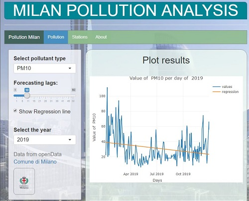
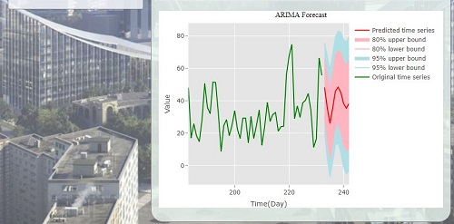
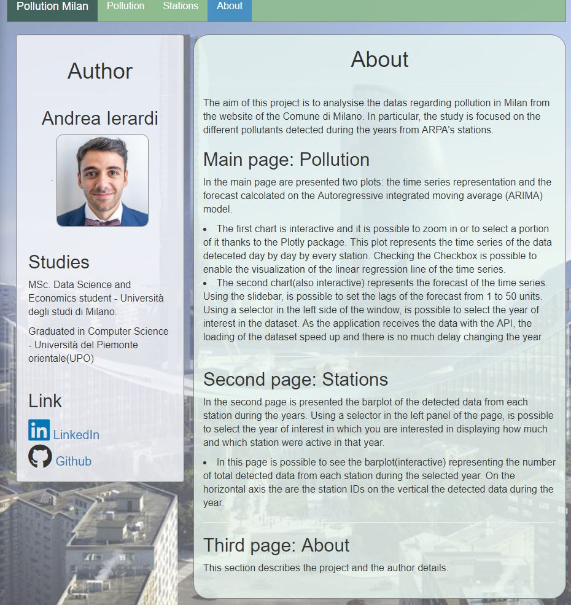

# 01a62bb0

<h1 align="center">Milan pollution Shiny App Package </h1>
<p> The aim of this project is to analysise the datas regarding pollution in Milan from the website of the Comune di Milano. In particular, the study is focused on the different pollutants detected during the years from ARPA stations. 
<br>
<h2> Installation</h2>

```R
# first install the R package "devtools" (.... OTHERS TO BE SPECIFIED) if not installed
devtools::install_github('unimi-dse/01a62bb0')
```

<h2> Usage</h2>
<p> Load the package. </p>

```R
require(milanpollution)
```
<p> There are three exported function in the package that are <code> pollution()</code>, <code> restfullAPI()</code> and <code> checkdataset()</code>.</p>

<h3> Functions </h3>
<li><code> pollution()</code></li>
<p> This function loads the Shiny  application. </p>
<li><code> restfullAPI()</code></li>
<p> Get the dataset from the Opendata website of the city of Milan using CRAN API. </p>

<li><code> checkdataset()</code></li>
<p> Check whether and which dataset is already loaded, download and visualise it.</p>

<h2> Dataset </h2>
<p> The study consists of 3 dataset named "Rilevazione qualità dell'aria" (Air Quality Detection) from year 2017 to 2019. 
The dataset is imported from the city of Milan website, in particular the <a href= "http://dati.comune.milano.it/"> Opendata Portal</a> using CKAN Application programming interface(API). </p>
<p> The datasets has 3 fields: </p>
- Date: date of the detected value
- Pollutant: type of pollutant
- Value: value of the pollutant
- Station_id: ID of the ARPA station.

<h2> Technologies </h2>

- Shiny App: interactive web apps
- R language

<br>
<h2> Description of the application </h2>
<p> When launched the pollution() function in the console, the application will start. It takes a bit to load the data from the OpenData Comune di Milano website since the app is using CKAN API. In particular, it checks the years 2017, 2018 and 2019 datasets. After the scraping function downloads the dataset and saved the data in the application memory. In this way, is not necessary to download the data each time we select the year of interest and the general performance are better. </p>

<h3> Main page: Pollution </h3>

<p> In the main page are presented two plots: the time series representation and the forecast calcolated on the Autoregressive integrated moving average (ARIMA) model. 


<li> The first chart is interactive and it is possible to zoom in or to select a portion of it thanks to the Plotly package. This plot represents the time series of the data deteceted day by day by every station. Checking the Checkbox is possible to enable the visualization of the linear regression line of the time series.


</li>
<br>

<li> The second chart(also interactive) represents the forecast of the time series. Using the slidebar, is possible to set the lags of the forecast from 1 to 50 units. 
<br>



</li>
<br>

<p> Using a selector in the left side of the window, is possible to select the year of interest in the dataset. As the application receives the data with the API, the loading of the dataset speed up and there is no much delay changing the year.</p>


<h3> Second page: Stations </h3>

<p> In the second page is presented the barplot of the detected data from each station during the years. Using a selector in the left panel of the page, is possible to select the year of interest in which you are interested in displaying how much and which station were active in that year.
</p>

<li>  In this page is possible to see the barplot(interactive) representing the number of total detected data from each station during the selected year. On the horizontal axis the are the station IDs on the vertical the detected data during the year. 


</li>
<h3> Third page: About </h3>
<li>This section describes the project and the author details. 


</li>
